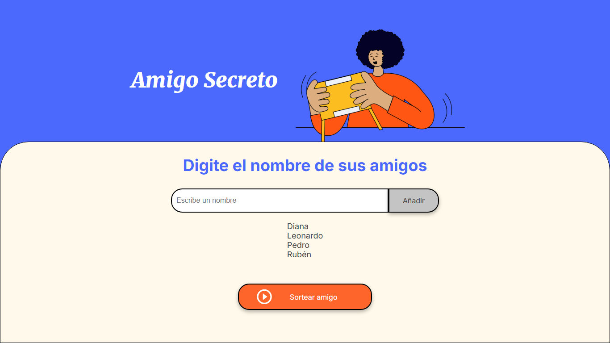
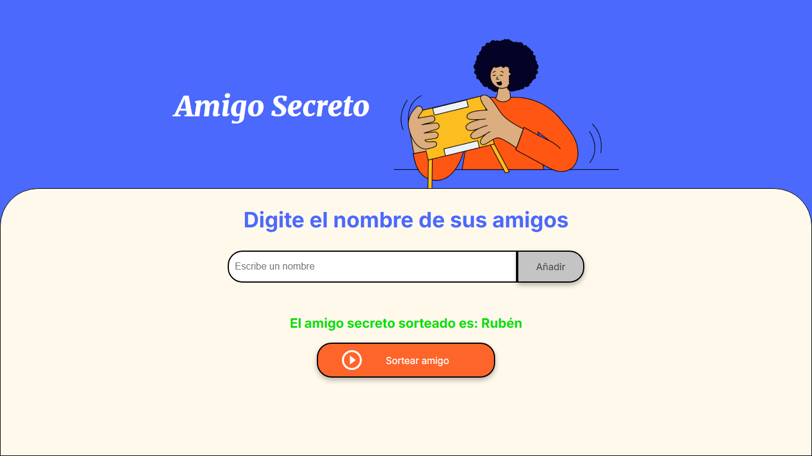

# Amigo Secreto

Este proyecto es una aplicación web que permite a los usuarios ingresar nombres de amigos para generar una lista, para luego realizar un sorteo aleatorio y determinar quién es el "amigo secreto".

## Funcionalidades

1. **Agregar nombres**: Los usuarios pueden escribir el nombre de un amigo en un campo de texto y agregarlo a una lista visible al hacer clic en "Añadir".
2. **Validar entrada**: Si el campo de texto está vacío, el programa mostrará una alerta pidiendo un nombre válido.
3. **Visualizar la lista**: Los nombres ingresados aparecerán en una lista debajo del campo de entrada.
4. **Validar sorteo**: Se requiere por lo menos 2 nombres de amigos para realizar "Sortear Amigo" de lo contrario, se muestra una alerta señalando las condiciones para que "Sortear Amigo" se ejecute.
5. **Sorteo aleatorio**: Al hacer clic en el botón "Sortear Amigo", se seleccionará aleatoriamente un nombre de la lista y se mostrará en la página.

## Estructura del Proyecto

El proyecto está compuesto por los siguientes archivos:

- `index.html`: Contiene la estructura HTML de la aplicación.
- `style.css`: Contiene los estilos CSS para la aplicación.
- `app.js`: Contiene la lógica de JavaScript para la aplicación.

## Cómo usar

1. Clona el repositorio en tu máquina local.
2. Abre el archivo `index.html` en tu navegador web.
3. Ingresa los nombres de los amigos en el campo de texto y haz clic en "Añadir".
4. Una vez que hayas agregado todos los nombres, haz clic en "Sortear Amigo" para realizar el sorteo.
5. Para reiniciar, basta con añadir un nombre y se iniciará una nueva lista de amigos.

## Ejemplo de Uso

1. Ingresa el nombre de un amigo en el campo de texto.
2. Haz clic en "Añadir" para agregar el nombre a la lista.
3. Repite los pasos anteriores para agregar más nombres.
4. Haz clic en "Sortear Amigo" para seleccionar un amigo secreto al azar.

## Capturas de Pantalla

## Tecnologías Utilizadas

- HTML
- CSS
- JavaScript

## Autor

- [Javier Acevedo](https://github.com/xaviac)

